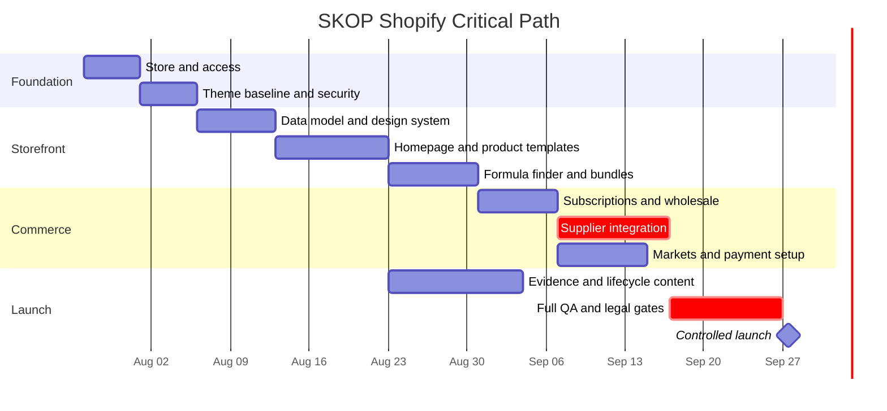

# SKOP Shopify Store Implementation Plan

> **For agentic workers:** REQUIRED SUB-SKILL: Use superpowers:subagent-driven-development (recommended) or superpowers:executing-plans to implement this plan task-by-task. Steps use checkbox (`- [ ]`) syntax for tracking.

**Goal:** Build, validate, and launch the SKOP direct-to-consumer and lightweight-wholesale Shopify store for the United States and Canada.

**Architecture:** Use one blended Shopify Basic store with a customized native Online Store 2.0 theme, Shopify-hosted checkout, structured product metafields and metaobjects, first-party Shopify apps, and the supplier's native Shopify integration. Keep formulation selection, bundle assembly, and theme presentation in small testable modules, while payment, subscription, B2B, market, and fulfillment state remain in Shopify.

**Tech Stack:** Shopify Basic, Liquid, Online Store 2.0 JSON templates, CSS, vanilla JavaScript, Shopify CLI 4.5.2, Shopify Theme Check, Node.js 22 LTS, Vitest 4.1.10, jsdom 29.1.1, Playwright 1.62.0, Axe 4.12.1, Lighthouse CI 0.15.1, Prettier 3.9.6, Shopify Liquid plugin 1.11.0.

## Global Constraints

- Brand name is `SKOP` and the primary domain is `skop.us`.
- Launch with five distinct 50 ml formulation families.
- Markets are the United States and Canada.
- Initial storefront language is English.
- Québec is included only after counsel reviews the English-first configuration, labels, packaging, commercial content, policies, and privacy obligations.
- Direct-to-consumer purchasing is primary, with lightweight wholesale in the same store.
- Subscription intervals are exactly 4, 6, and 8 weeks.
- One-time purchase is the default and subscription is never preselected.
- Native Shopify Bundles cannot be used for a subscription product.
- Subscription-eligible kits require supplier-managed standalone SKUs.
- Use Shopify-hosted checkout and do not handle card data in theme code.
- Use first-party Shopify apps unless a paid app passes the documented capability, permissions, cost, and value review.
- Product claims remain inactive until they match approved evidence and labels.
- Custom storefront controls target WCAG 2.2 AA.
- Theme functionality must work for navigation and basic product purchase when JavaScript is disabled.
- No production theme is published until all launch gates in the approved design specification pass.
- Never store Shopify passwords, payment credentials, supplier credentials, or API secrets in the repository.

---

## Delivery Milestones

This master plan is divided into independently testable milestones:

1. **Foundation:** Store, repository, theme baseline, security, and repeatable tooling
2. **Storefront:** Visual system, structured data, homepage, product pages, formula finder, and bundles
3. **Commerce operations:** Subscriptions, wholesale, supplier integration, markets, payments, taxes, shipping, domain, and messaging
4. **Launch:** Evidence, policies, analytics, accessibility, performance, end-to-end tests, controlled publication, and monitoring

Each task below ends with a reviewable deliverable and a focused commit.

## Source Layout

```text
skop-shopify/
├── .github/
│   └── workflows/
│       └── theme-ci.yml
├── assets/
│   ├── skop-base.css
│   ├── skop-bundle-builder.js
│   ├── skop-formula-finder.js
│   ├── skop-formula-rules.json
│   ├── skop-mark.svg
│   ├── skop-tokens.css
│   └── skop-wordmark.svg
├── config/
│   ├── settings_data.json
│   ├── settings_schema.json
│   ├── shopify-custom-data.yml
│   └── tracking-plan.yml
├── docs/
│   ├── runbooks/
│   │   ├── admin-security.md
│   │   ├── fulfillment-exceptions.md
│   │   ├── launch-and-rollback.md
│   │   └── supplier-reconciliation.md
│   └── superpowers/
│       ├── plans/
│       └── specs/
├── scripts/
│   ├── validate-custom-data.mjs
│   ├── validate-formula-rules.mjs
│   └── validate-tracking-plan.mjs
├── tests/
│   ├── e2e/
│   │   ├── accessibility.spec.js
│   │   ├── formula-finder.spec.js
│   │   ├── homepage.spec.js
│   │   └── product-purchase.spec.js
│   └── unit/
│       ├── bundle-builder.test.js
│       ├── custom-data.test.js
│       ├── formula-finder.test.js
│       └── tracking-plan.test.js
├── layout/
│   └── theme.liquid
├── locales/
│   └── en.default.json
├── sections/
│   ├── skop-evidence-grid.liquid
│   ├── skop-bundle-builder.liquid
│   ├── skop-formula-family-grid.liquid
│   ├── skop-formula-finder.liquid
│   ├── skop-hero.liquid
│   ├── skop-proof-bar.liquid
│   ├── skop-product-evidence.liquid
│   ├── skop-product-main.liquid
│   ├── skop-wholesale-application.liquid
│   └── skop-wholesale-cta.liquid
├── snippets/
│   ├── skop-formula-badge.liquid
│   ├── skop-formula-card.liquid
│   ├── skop-proof-item.liquid
│   └── skop-purchase-selector.liquid
├── templates/
│   ├── index.json
│   ├── page.formula-finder.json
│   ├── page.results.json
│   ├── page.wholesale.json
│   └── product.skop.json
├── .gitignore
├── .prettierrc.json
├── package-lock.json
├── package.json
├── playwright.config.js
└── vitest.config.js
```

## Runtime Inputs and User Gates

The implementation captures these task-specific environment variables only after Shopify returns the corresponding values:

```bash
read -r -p "Shopify myshopify.com hostname: " SKOP_SHOPIFY_STORE
case "$SKOP_SHOPIFY_STORE" in
  *.myshopify.com) export SKOP_SHOPIFY_STORE ;;
  *) echo "Invalid Shopify store hostname" >&2; exit 1 ;;
esac

read -r -p "Complete Shopify development-theme preview URL: " SKOP_PREVIEW_URL
case "$SKOP_PREVIEW_URL" in
  https://*) export SKOP_PREVIEW_URL ;;
  *) echo "Preview URL must use HTTPS" >&2; exit 1 ;;
esac
```

The user must directly confirm or complete:

- Shopify account ownership and sign-in
- Paid plan purchase
- Business identity and Shopify Payments verification
- Bank payout connection
- Domain registrar access and DNS changes
- Supplier app installation and supplier authorization
- Final pricing, subscription discount, product names, and supplier SKUs
- Approved labels, claims, policies, evidence, and Québec legal position
- Production theme publication

No task bypasses these gates.

---

### Task 1: Repository, Toolchain, and Theme Baseline

**Files:**

- Create: `package.json`
- Create: `package-lock.json`
- Create: `.gitignore`
- Create: `.prettierrc.json`
- Create: `vitest.config.js`
- Create: `playwright.config.js`
- Create: `.github/workflows/theme-ci.yml`
- Create or pull: `assets/**`, `config/**`, `layout/**`, `locales/**`, `sections/**`, `snippets/**`, and `templates/**`
- Test: `tests/e2e/homepage.spec.js`

**Interfaces:**

- Consumes: Shopify's official Dawn reference theme repository
- Produces: Repeatable `npm run check`, `npm run test:unit`, and `npm run test:e2e` commands, plus a version-controlled Online Store 2.0 theme baseline

- [ ] **Step 1: Create an isolated project repository**

Run from the workspace parent:

```bash
mkdir skop-shopify
cd skop-shopify
git init
git branch -M main
```

Expected: All implementation files and commits live under `skop-shopify/`, isolated from unrelated workspace files.

- [ ] **Step 2: Create the project manifest**

```json
{
  "name": "skop-shopify",
  "private": true,
  "engines": {
    "node": ">=22 <23"
  },
  "scripts": {
    "format:check": "prettier --check .",
    "format:write": "prettier --write .",
    "theme:check": "shopify theme check --path .",
    "test:unit": "vitest run",
    "test:coverage": "vitest run --coverage",
    "test:e2e": "playwright test",
    "check": "npm run format:check && npm run theme:check && npm run test:coverage"
  },
  "devDependencies": {
    "@axe-core/playwright": "4.12.1",
    "@lhci/cli": "0.15.1",
    "@playwright/test": "1.62.0",
    "@shopify/cli": "4.5.2",
    "@shopify/prettier-plugin-liquid": "1.11.0",
    "@vitest/coverage-v8": "4.1.10",
    "jsdom": "29.1.1",
    "prettier": "3.9.6",
    "vitest": "4.1.10",
    "yaml": "2.9.0"
  }
}
```

- [ ] **Step 3: Create formatting and test configuration**

```json
{
  "plugins": ["@shopify/prettier-plugin-liquid"],
  "printWidth": 100,
  "singleQuote": true
}
```

```js
// vitest.config.js
import { defineConfig } from 'vitest/config';

export default defineConfig({
  test: {
    environment: 'jsdom',
    include: ['tests/unit/**/*.test.js'],
    coverage: {
      reporter: ['text', 'json-summary'],
      thresholds: { lines: 90, functions: 90, branches: 85, statements: 90 },
    },
  },
});
```

```js
// playwright.config.js
import { defineConfig, devices } from '@playwright/test';

if (!process.env.SKOP_PREVIEW_URL) {
  throw new Error('SKOP_PREVIEW_URL is required for end-to-end tests');
}

export default defineConfig({
  testDir: './tests/e2e',
  use: {
    baseURL: process.env.SKOP_PREVIEW_URL,
    trace: 'retain-on-failure',
    screenshot: 'only-on-failure',
  },
  projects: [
    { name: 'desktop-chromium', use: { ...devices['Desktop Chrome'] } },
    { name: 'mobile-chromium', use: { ...devices['Pixel 7'] } },
  ],
});
```

- [ ] **Step 4: Install and lock dependencies**

Run:

```bash
NPM_CONFIG_CACHE=/tmp/skop-npm-cache npm install
npx playwright install chromium
```

Expected: `package-lock.json` is created, the Chromium test browser is installed, and `npm audit --omit=dev` reports no production dependencies.

- [ ] **Step 5: Initialize the official theme baseline**

Run:

```bash
npx shopify theme init /tmp/skop-dawn --clone-url https://github.com/Shopify/dawn.git
cp -R /tmp/skop-dawn/assets /tmp/skop-dawn/config /tmp/skop-dawn/layout /tmp/skop-dawn/locales /tmp/skop-dawn/sections /tmp/skop-dawn/snippets /tmp/skop-dawn/templates .
```

Expected: `layout/theme.liquid`, `config/settings_schema.json`, and the base theme templates exist locally.

- [ ] **Step 6: Write a smoke test**

```js
// tests/e2e/homepage.spec.js
import { expect, test } from '@playwright/test';

test('homepage exposes primary navigation and one main heading', async ({ page }) => {
  await page.goto('/');
  await expect(page.locator('header')).toBeVisible();
  await expect(page.locator('main h1')).toHaveCount(1);
  await expect(page.getByRole('link', { name: /shop/i })).toBeVisible();
});
```

- [ ] **Step 7: Run the baseline checks**

Run:

```bash
npm run format:check
npm run theme:check
```

Expected: Both commands exit successfully before SKOP customization begins.

- [ ] **Step 8: Add continuous integration**

```yaml
# .github/workflows/theme-ci.yml
name: Theme CI
on:
  pull_request:
  push:
    branches: [main]
jobs:
  check:
    runs-on: ubuntu-latest
    steps:
      - uses: actions/checkout@v4
      - uses: actions/setup-node@v4
        with:
          node-version: 22
          cache: npm
      - run: npm ci
      - run: npm run check
```

- [ ] **Step 9: Commit**

```bash
git add package.json package-lock.json .gitignore .prettierrc.json vitest.config.js playwright.config.js .github theme tests/e2e/homepage.spec.js
git commit -m "chore: establish SKOP Shopify theme baseline"
```

---

### Task 2: Shopify Store Creation, Ownership, and Administrative Security

**Files:**

- Create: `docs/runbooks/admin-security.md`

**Interfaces:**

- Consumes: User-owned Shopify account, store contact information, legal business information
- Produces: A new user-owned SKOP store, secure administrator access, Shopify Basic plan after user confirmation, and documented recovery controls

- [ ] **Step 1: Create the store in the user's authenticated browser**

Open Shopify's store-creation flow, create a new store named `SKOP`, and record the exact `myshopify.com` hostname in the runbook. Do not purchase a plan during this step.

- [ ] **Step 2: Confirm ownership**

Verify in Shopify Admin that:

```text
Store owner: user-controlled account
Store name: SKOP
Primary contact email: user-approved business email
Store status: trial or development, not publicly published
```

- [ ] **Step 3: Enable strong authentication**

For the owner account, enable a passkey or two-factor authentication and verify recovery methods. Create separate named staff or collaborator access for implementation rather than sharing the owner password.

- [ ] **Step 4: Record the security runbook**

```markdown
# SKOP Admin Security

- Store owner retains billing, payout, domain, and user-management control.
- Every administrator uses a named account and passkey or two-factor authentication.
- Collaborator access is limited to the permissions required by the active task.
- Production theme publication requires owner confirmation.
- Unused staff, collaborators, and apps are reviewed monthly and removed.
- Recovery codes are stored by the owner outside the repository.
- No credentials or recovery material are committed to source control.
```

- [ ] **Step 5: Select Shopify Basic after user confirmation**

Present the current plan terms and obtain explicit confirmation immediately before the paid-plan action. Verify the resulting plan name in Shopify Admin.

- [ ] **Step 6: Authenticate Shopify CLI and start the development theme**

Run authentication once:

```bash
npx shopify auth login
```

Start the development theme in a dedicated terminal and keep it running during browser tests:

```bash
npx shopify theme dev --store "$SKOP_SHOPIFY_STORE" --path .
```

Expected: Shopify CLI returns editor and preview URLs. Capture the complete preview URL as `SKOP_PREVIEW_URL` using the validated input block under Runtime Inputs.

- [ ] **Step 7: Verify security state**

Expected:

```text
Owner account protected by passkey or two-factor authentication
No shared administrator account
Implementation account lacks billing and payout permissions
Storefront password protection remains enabled
```

- [ ] **Step 8: Commit**

```bash
git add docs/runbooks/admin-security.md
git commit -m "docs: define SKOP Shopify admin security controls"
```

---

### Task 3: Precision Performance Theme Foundation

**Files:**

- Create: `assets/skop-tokens.css`
- Create: `assets/skop-base.css`
- Create: `assets/skop-wordmark.svg`
- Create: `assets/skop-mark.svg`
- Modify: `layout/theme.liquid`
- Modify: `config/settings_schema.json`
- Modify: `sections/header.liquid`
- Modify: `sections/footer.liquid`
- Modify: `locales/en.default.json`
- Test: `tests/e2e/homepage.spec.js`

**Interfaces:**

- Consumes: Approved Precision Performance visual direction
- Produces: Reusable CSS tokens, SKOP typography and color primitives, accessible focus styles, and theme settings for all five formulation accents

- [ ] **Step 1: Add a failing token-presence unit test**

```js
// tests/unit/custom-data.test.js
import { readFileSync } from 'node:fs';
import { describe, expect, it } from 'vitest';

describe('SKOP design tokens', () => {
  it('defines the master and five formulation colors', () => {
    const css = readFileSync('assets/skop-tokens.css', 'utf8');
    for (const token of [
      '--skop-graphite',
      '--skop-mineral',
      '--skop-mint',
      '--skop-shooting',
      '--skop-racket',
      '--skop-vertical',
      '--skop-pole',
      '--skop-focus',
    ]) {
      expect(css).toContain(token);
    }
  });
});
```

- [ ] **Step 2: Run the test and verify failure**

Run:

```bash
npx vitest run tests/unit/custom-data.test.js
```

Expected: FAIL because `assets/skop-tokens.css` does not exist.

- [ ] **Step 3: Implement the tokens**

```css
/* assets/skop-tokens.css */
:root {
  --skop-graphite: #0d1214;
  --skop-graphite-soft: #182326;
  --skop-mineral: #f2f5f3;
  --skop-white: #ffffff;
  --skop-mint: #50f0bd;
  --skop-shooting: #ffb347;
  --skop-racket: #b9eb48;
  --skop-vertical: #4bd8ea;
  --skop-pole: #ff5ca8;
  --skop-focus: #9271ff;
  --skop-text-muted: #68756f;
  --skop-border: #d6ddda;
  --skop-radius-sm: 0.25rem;
  --skop-radius-md: 0.625rem;
  --skop-space-section: clamp(3rem, 7vw, 7rem);
  --skop-focus-ring: 0 0 0 3px var(--skop-white), 0 0 0 6px var(--skop-mint);
}
```

- [ ] **Step 4: Add accessible base rules**

```css
/* assets/skop-base.css */
.skop-section {
  padding-block: var(--skop-space-section);
}

.skop-eyebrow {
  color: var(--skop-mint);
  font-size: 0.75rem;
  font-weight: 800;
  letter-spacing: 0.16em;
  text-transform: uppercase;
}

:where(a, button, input, select, textarea):focus-visible {
  border-radius: var(--skop-radius-sm);
  box-shadow: var(--skop-focus-ring);
  outline: 0;
}

@media (prefers-reduced-motion: reduce) {
  *,
  *::before,
  *::after {
    scroll-behavior: auto !important;
    transition-duration: 0.01ms !important;
    animation-duration: 0.01ms !important;
    animation-iteration-count: 1 !important;
  }
}
```

- [ ] **Step 5: Load assets in the theme layout**

Add before `</head>` in `layout/theme.liquid`:

```liquid
{{ 'skop-tokens.css' | asset_url | stylesheet_tag }}
{{ 'skop-base.css' | asset_url | stylesheet_tag }}
```

- [ ] **Step 6: Create the production vector marks**

Create `skop-wordmark.svg` with the approved uppercase geometric `SKOP` wordmark and mint terminal dot. Create `skop-mark.svg` as the compact `S` plus mint-dot mark for favicon and square placements. Both files must use `currentColor` for the graphite or white lettering and `#50f0bd` for the dot, contain a `viewBox`, and contain no embedded raster image, script, metadata, or external font reference.

- [ ] **Step 7: Configure header and footer identity**

Use the wordmark in `sections/header.liquid`, preserve a text `SKOP` fallback, and use the mark for the favicon through theme settings. Configure footer navigation, support contact, wholesale link, policies, and newsletter without duplicating navigation markup.

- [ ] **Step 8: Run tests and Theme Check**

Run:

```bash
npm run test:unit
npm run theme:check
```

Expected: PASS with no Theme Check errors.

- [ ] **Step 9: Commit**

```bash
git add assets layout/theme.liquid config locales tests/unit/custom-data.test.js
git commit -m "feat: add SKOP Precision Performance theme foundation"
```

---

### Task 4: Shopify Custom Data Definitions

**Files:**

- Create: `config/shopify-custom-data.yml`
- Create: `scripts/validate-custom-data.mjs`
- Test: `tests/unit/custom-data.test.js`

**Interfaces:**

- Consumes: Approved SKOP product and evidence model
- Produces: Canonical merchant-owned metafield and metaobject definitions plus five draft formulation products used by Liquid templates and formula rules

- [ ] **Step 1: Write the custom-data manifest**

```yaml
namespace: skop
product_metafields:
  - { key: formula_code, type: single_line_text_field, required: true }
  - { key: formula_family, type: single_line_text_field, required: true }
  - { key: accent_color, type: color, required: true }
  - { key: supported_activities, type: list.single_line_text_field, required: true }
  - { key: perspiration_profile, type: multi_line_text_field, required: true }
  - { key: grip_profile, type: multi_line_text_field, required: true }
  - { key: drying_time, type: single_line_text_field, required: true }
  - { key: session_duration, type: single_line_text_field, required: true }
  - { key: application_amount, type: multi_line_text_field, required: true }
  - { key: ingredients, type: multi_line_text_field, required: true }
  - { key: warnings, type: multi_line_text_field, required: true }
  - { key: supplier_sku, type: single_line_text_field, required: true }
  - { key: subscription_eligible, type: boolean, required: true }
  - { key: bundle_type, type: single_line_text_field, required: true }
metaobjects:
  - handle: laboratory_result
    fields:
      - { key: title, type: single_line_text_field, required: true }
      - { key: summary, type: multi_line_text_field, required: true }
      - { key: method, type: multi_line_text_field, required: true }
      - { key: result_file, type: file_reference, required: true }
  - handle: safety_document
    fields:
      - { key: title, type: single_line_text_field, required: true }
      - { key: jurisdiction, type: single_line_text_field, required: true }
      - { key: document, type: file_reference, required: true }
  - handle: endorsement
    fields:
      - { key: name, type: single_line_text_field, required: true }
      - { key: discipline, type: single_line_text_field, required: true }
      - { key: quote, type: multi_line_text_field, required: true }
      - { key: permission_record, type: file_reference, required: true }
  - handle: formula_rule
    fields:
      - { key: activity, type: single_line_text_field, required: true }
      - { key: formula_code, type: single_line_text_field, required: true }
      - { key: explanation, type: multi_line_text_field, required: true }
```

- [ ] **Step 2: Write the manifest validator**

```js
// scripts/validate-custom-data.mjs
import { readFileSync } from 'node:fs';
import YAML from 'yaml';

const manifest = YAML.parse(readFileSync('config/shopify-custom-data.yml', 'utf8'));
const allowedTypes = new Set([
  'single_line_text_field',
  'multi_line_text_field',
  'list.single_line_text_field',
  'color',
  'boolean',
  'file_reference',
]);

const keys = manifest.product_metafields.map(({ key }) => key);
if (new Set(keys).size !== keys.length) throw new Error('Duplicate product metafield key');
for (const field of manifest.product_metafields) {
  if (!allowedTypes.has(field.type)) throw new Error(`Unsupported type: ${field.type}`);
}
for (const object of manifest.metaobjects) {
  if (!object.handle || object.fields.length === 0) {
    throw new Error('Every metaobject requires a handle and fields');
  }
}
console.log('Custom data manifest valid');
```

- [ ] **Step 3: Add validator tests**

```js
import { execFileSync } from 'node:child_process';
import { expect, it } from 'vitest';

it('validates the canonical Shopify custom-data manifest', () => {
  expect(() => execFileSync('node', ['scripts/validate-custom-data.mjs'])).not.toThrow();
});
```

- [ ] **Step 4: Run the validator**

Run:

```bash
node scripts/validate-custom-data.mjs
npm run test:unit
```

Expected: `Custom data manifest valid` and all unit tests pass.

- [ ] **Step 5: Create definitions in Shopify Admin**

Create each definition under `Settings > Custom data` with namespace `skop`, matching key, type, and required state exactly. Export screenshots or a checklist showing every definition and compare them to the manifest.

- [ ] **Step 6: Pull metafield definitions for local verification**

Run:

```bash
npx shopify theme metafields pull --store "$SKOP_SHOPIFY_STORE"
```

Expected: Shopify CLI completes without definition errors.

- [ ] **Step 7: Create five draft formulation products**

Create unpublished products with stable handles and internal codes:

```text
skop-f01-shooting, F01
skop-f02-racket, F02
skop-f03-vertical-strength, F03
skop-f04-pole, F04
skop-f05-focus-control, F05
```

Each draft product has one 50 ml variant, its assigned accent color, subscription eligibility, and supported activities. The supplier SKU stays unset while the product remains Draft, then receives the validated supplier value before any inventory or fulfillment test. Product status remains Draft until final product names, prices, labels, inventory, media, and claims pass launch review.

- [ ] **Step 8: Commit**

```bash
git add config/shopify-custom-data.yml scripts/validate-custom-data.mjs tests/unit/custom-data.test.js
git commit -m "feat: define SKOP product and evidence data model"
```

---

### Task 5: Navigation, Homepage, and Reusable Formula Components

**Files:**

- Create: `sections/skop-hero.liquid`
- Create: `sections/skop-formula-family-grid.liquid`
- Create: `sections/skop-evidence-grid.liquid`
- Create: `sections/skop-wholesale-cta.liquid`
- Create: `snippets/skop-formula-card.liquid`
- Create: `snippets/skop-proof-item.liquid`
- Modify: `templates/index.json`
- Modify: `sections/header.liquid`
- Modify: `sections/footer.liquid`
- Modify: `config/settings_data.json`
- Test: `tests/e2e/homepage.spec.js`

**Interfaces:**

- Consumes: Design tokens and product metafields from Tasks 3 and 4
- Produces: Approved homepage conversion sequence and reusable formula-card presentation

- [ ] **Step 1: Expand the failing homepage test**

```js
test('homepage presents the approved conversion path', async ({ page }) => {
  await page.goto('/');
  await expect(page.getByRole('heading', { level: 1 })).toContainText(/control/i);
  await expect(page.getByRole('link', { name: /find your formula/i })).toBeVisible();
  await expect(page.locator('[data-skop-formula-card]')).toHaveCount(5);
  await expect(page.getByText(/lab.*athlete tested/i)).toBeVisible();
  await expect(page.getByRole('link', { name: /wholesale/i })).toBeVisible();
});
```

- [ ] **Step 2: Run the test and verify failure**

Run:

```bash
npx playwright test tests/e2e/homepage.spec.js
```

Expected: FAIL because the SKOP sections do not exist.

- [ ] **Step 3: Implement the formula-card snippet**

```liquid
 snippets/skop-formula-card.liquid 
<article
  class='skop-formula-card'
  data-skop-formula-card
  style='--formula-accent: {{ product.metafields.skop.accent_color.value | default: '#50f0bd' }};'
>
  <p class='skop-eyebrow'>{{ product.metafields.skop.formula_code.value }}</p>
  <h3>
    <a href='{{ product.url }}'>{{ product.title | escape }}</a>
  </h3>
  <p>{{ product.metafields.skop.grip_profile.value | escape }}</p>
</article>
```

- [ ] **Step 4: Implement the hero and formula grid as configurable sections**

The hero schema must expose heading, body, primary link, secondary link, and product image settings. The formula grid must accept one collection and render exactly five published formulation products.

- [ ] **Step 5: Configure the homepage template**

Set `templates/index.json` section order to the following section identifiers. Use custom sections for SKOP-specific behavior and Dawn's existing `multicolumn`, `video`, `featured-collection`, and `email-signup-banner` types for generic content:

```json
[
  "skop_hero",
  "skop_proof_bar",
  "skop_formula_family_grid",
  "how_it_works",
  "skop_evidence_grid",
  "demo_video",
  "endorsements",
  "bundles",
  "testimonials",
  "skop_wholesale_cta",
  "newsletter"
]
```

- [ ] **Step 6: Configure navigation in Shopify Admin**

Create the primary menu in this order:

```text
Shop
Find Your Formula
How It Works
Results
Wholesale
```

- [ ] **Step 7: Run checks**

Run:

```bash
npm run theme:check
npx playwright test tests/e2e/homepage.spec.js
```

Expected: Theme Check passes and homepage tests pass on desktop and mobile.

- [ ] **Step 8: Commit**

```bash
git add sections snippets templates/index.json tests/e2e/homepage.spec.js
git commit -m "feat: build SKOP homepage and formula navigation"
```

---

### Task 6: SKOP Product Template and Purchase Selector

**Files:**

- Create: `sections/skop-product-main.liquid`
- Create: `sections/skop-product-evidence.liquid`
- Create: `snippets/skop-formula-badge.liquid`
- Create: `snippets/skop-purchase-selector.liquid`
- Create: `templates/product.skop.json`
- Test: `tests/e2e/product-purchase.spec.js`

**Interfaces:**

- Consumes: Product fields, evidence references, Shopify product form, and Shopify Subscriptions app block
- Produces: Accessible one-time and subscription product-purchase experience for a 50 ml formulation

- [ ] **Step 1: Write the product-purchase test**

```js
// tests/e2e/product-purchase.spec.js
import { expect, test } from '@playwright/test';

test('one-time purchase is the default and subscription is opt-in', async ({ page }) => {
  await page.goto('/collections/all');
  await page.locator('[data-skop-formula-card] a').first().click();
  await expect(page.locator('input[name="selling_plan"]:checked')).toHaveCount(0);
  await expect(page.getByRole('button', { name: /add to cart/i })).toBeEnabled();
});

test('product exposes evidence, ingredients, instructions, and reviews', async ({ page }) => {
  await page.goto('/collections/all');
  await page.locator('[data-skop-formula-card] a').first().click();
  for (const label of [/results/i, /ingredients/i, /how to apply/i, /reviews/i]) {
    await expect(page.getByRole('heading', { name: label })).toBeVisible();
  }
});
```

- [ ] **Step 2: Verify failure**

Run:

```bash
npx playwright test tests/e2e/product-purchase.spec.js
```

Expected: FAIL because the SKOP product template is not assigned.

- [ ] **Step 3: Implement a progressively enhanced product form**

```liquid
 snippets/skop-purchase-selector.liquid 

  <input type='hidden' name='id' value='{{ product.selected_or_first_available_variant.id }}'>
  <p>{{ 'products.one_time_available' | t }}</p>
  <div data-subscription-app-block>
    
      
        
      
    
  </div>
  <label for='skop-quantity'>{{ 'products.quantity' | t }}</label>
  <input id='skop-quantity' name='quantity' type='number' min='1' value='1'>
  <button
    type='submit'
    
      disabled
    
  >
    {{ 'products.add_to_cart' | t }}
  </button>

```

Add an `@app` block to the section schema so the first-party Shopify Subscriptions widget controls the real `selling_plan` input. Do not create a parallel purchase-type input that Shopify checkout does not recognize.

- [ ] **Step 4: Implement evidence and safety rendering**

Render no claim block unless the corresponding metaobject reference exists and is published. Render document links with descriptive accessible names and file type.

- [ ] **Step 5: Assign the `product.skop` template to every formulation product**

Verify each product has:

```text
Size: 50 ml
One supplier SKU
One formulation code
One accent color
At least one supported activity
Ingredients and warnings
Subscription eligibility
```

- [ ] **Step 6: Test with JavaScript disabled**

Use browser developer tools or Playwright context configuration to disable JavaScript. Confirm that one-time quantity selection, add to cart, navigation, ingredients, and safety content remain usable.

- [ ] **Step 7: Run checks**

Run:

```bash
npm run theme:check
npx playwright test tests/e2e/product-purchase.spec.js
```

Expected: PASS.

- [ ] **Step 8: Commit**

```bash
git add sections/skop-product-main.liquid sections/skop-product-evidence.liquid snippets/skop-formula-badge.liquid snippets/skop-purchase-selector.liquid templates/product.skop.json tests/e2e/product-purchase.spec.js
git commit -m "feat: add SKOP product and purchase experience"
```

---

### Task 7: Formula Finder Rules and User Experience

**Files:**

- Create: `assets/skop-formula-rules.json`
- Create: `scripts/validate-formula-rules.mjs`
- Create: `assets/skop-formula-finder.js`
- Create: `sections/skop-formula-finder.liquid`
- Create: `templates/page.formula-finder.json`
- Test: `tests/unit/formula-finder.test.js`
- Test: `tests/e2e/formula-finder.spec.js`

**Interfaces:**

- Consumes: Five formulation codes, stable product handles, and approved product usage metafields
- Produces: `recommendFormula(input, rules)` returning `{ formulaCode, explanation, intervalWeeks, applicationProfile, packRecommendation }`

- [ ] **Step 1: Define exact formula rules**

```json
{
  "formulas": {
    "F01": { "title": "Shooting", "handle": "skop-f01-shooting" },
    "F02": { "title": "Racket", "handle": "skop-f02-racket" },
    "F03": { "title": "Vertical + Strength", "handle": "skop-f03-vertical-strength" },
    "F04": { "title": "Pole", "handle": "skop-f04-pole" },
    "F05": { "title": "Drumming + Gaming", "handle": "skop-f05-focus-control" }
  },
  "activities": {
    "shooting": "F01",
    "racket": "F02",
    "climbing": "F03",
    "crossfit": "F03",
    "weightlifting": "F03",
    "ninja": "F03",
    "pole": "F04",
    "drumming": "F05",
    "gaming": "F05"
  },
  "intervalWeeks": {
    "short": 8,
    "medium": 6,
    "long": 4
  },
  "applicationProfile": {
    "light": "light",
    "moderate": "moderate",
    "heavy": "heavy"
  },
  "packRecommendation": {
    "short": "single",
    "medium": "two_pack",
    "long": "three_pack"
  }
}
```

- [ ] **Step 2: Write failing unit tests**

```js
import { describe, expect, it } from 'vitest';
import { recommendFormula } from '../../assets/skop-formula-finder.js';

const rules = {
  formulas: {
    F01: { title: 'Shooting', handle: 'skop-f01-shooting' },
    F03: { title: 'Vertical + Strength', handle: 'skop-f03-vertical-strength' },
    F05: { title: 'Drumming + Gaming', handle: 'skop-f05-focus-control' },
  },
  activities: { shooting: 'F01', climbing: 'F03', gaming: 'F05' },
  intervalWeeks: { short: 8, medium: 6, long: 4 },
  applicationProfile: { light: 'light', moderate: 'moderate', heavy: 'heavy' },
  packRecommendation: { short: 'single', medium: 'two_pack', long: 'three_pack' },
};

describe('recommendFormula', () => {
  it('maps activity to the approved formula family', () => {
    expect(
      recommendFormula(
        {
          activity: 'climbing',
          perspiration: 'heavy',
          gripPreference: 'controlled',
          session: 'long',
          skinPriority: 'gentle',
          equipmentPriority: 'low_residue',
        },
        rules,
      ),
    ).toMatchObject({
      formulaCode: 'F03',
      intervalWeeks: 4,
      applicationProfile: 'heavy',
      packRecommendation: 'three_pack',
    });
  });

  it('rejects an unsupported activity instead of substituting', () => {
    expect(() => recommendFormula({ activity: 'cycling', session: 'short' }, rules)).toThrow(
      'Unsupported activity: cycling',
    );
  });
});
```

- [ ] **Step 3: Verify test failure**

Run:

```bash
npx vitest run tests/unit/formula-finder.test.js
```

Expected: FAIL because `recommendFormula` does not exist.

- [ ] **Step 4: Implement the pure recommendation function**

```js
// assets/skop-formula-finder.js
export function recommendFormula(input, rules) {
  const formulaCode = rules.activities[input.activity];
  if (!formulaCode) throw new Error(`Unsupported activity: ${input.activity}`);
  const intervalWeeks = rules.intervalWeeks[input.session];
  if (!intervalWeeks) throw new Error(`Unsupported session duration: ${input.session}`);
  const applicationProfile = rules.applicationProfile[input.perspiration];
  if (!applicationProfile) throw new Error(`Unsupported perspiration level: ${input.perspiration}`);
  const packRecommendation = rules.packRecommendation[input.session];
  return {
    formulaCode,
    intervalWeeks,
    applicationProfile,
    packRecommendation,
    explanation:
      `Selected for ${input.activity}, ${input.gripPreference} grip, ` +
      `${input.session} sessions, ${input.skinPriority} skin priority, ` +
      `and ${input.equipmentPriority} equipment priority.`,
  };
}
```

- [ ] **Step 5: Implement accessible step navigation**

Use one form with semantic fieldsets and a live result region. Load the pure function as a JavaScript module and fetch `skop-formula-rules.json` through its Shopify asset URL rendered into `data-rules-url`:

```html
<form data-formula-finder data-rules-url="{{ 'skop-formula-rules.json' | asset_url }}">
  <fieldset data-step="activity">
    <legend>What activity are you preparing for?</legend>
  </fieldset>
  <fieldset data-step="perspiration" hidden>
    <legend>How much do your hands perspire during a session?</legend>
  </fieldset>
  <fieldset data-step="grip" hidden>
    <legend>What grip feel do you prefer?</legend>
  </fieldset>
  <fieldset data-step="session" hidden>
    <legend>How long is a typical session?</legend>
  </fieldset>
  <fieldset data-step="equipment" hidden>
    <legend>How important is minimizing equipment residue?</legend>
  </fieldset>
  <fieldset data-step="skin" hidden>
    <legend>Which skin-contact priority matters most?</legend>
  </fieldset>
  <p role="status" aria-live="polite" data-formula-result></p>
</form>
```

- [ ] **Step 6: Add end-to-end coverage**

```js
test('formula finder recommends the climbing family without substitution', async ({ page }) => {
  await page.goto('/pages/find-your-formula');
  await page.getByLabel('Climbing').check();
  await page.getByRole('button', { name: /next/i }).click();
  await page.getByLabel(/heavy perspiration/i).check();
  await page.getByRole('button', { name: /next/i }).click();
  await page.getByLabel(/controlled grip/i).check();
  await page.getByRole('button', { name: /next/i }).click();
  await page.getByLabel(/long session/i).check();
  await page.getByRole('button', { name: /next/i }).click();
  await page.getByLabel(/minimize residue/i).check();
  await page.getByRole('button', { name: /next/i }).click();
  await page.getByLabel(/gentle skin contact/i).check();
  await page.getByRole('button', { name: /see my formula/i }).click();
  await expect(page.locator('[data-formula-result]')).toContainText(/vertical.*strength/i);
});
```

- [ ] **Step 7: Validate every answer path**

Run a script that loads `assets/skop-formula-rules.json`, verifies every listed activity maps to one of `F01` through `F05`, verifies every formula points to one stable draft product handle, verifies every interval is one of `4`, `6`, or `8`, and verifies every perspiration and session choice has an application profile and pack recommendation. The result page resolves the application profile to the selected product's approved `skop.application_amount` metafield, so no unapproved use instruction is embedded in JavaScript.

- [ ] **Step 8: Run all tests**

Run:

```bash
npm run test:unit
npx playwright test tests/e2e/formula-finder.spec.js
npm run theme:check
```

Expected: PASS.

- [ ] **Step 9: Commit**

```bash
git add assets/skop-formula-rules.json scripts/validate-formula-rules.mjs assets/skop-formula-finder.js sections/skop-formula-finder.liquid templates/page.formula-finder.json tests/unit/formula-finder.test.js tests/e2e/formula-finder.spec.js
git commit -m "feat: add deterministic SKOP formula finder"
```

---

### Task 8: Bundle Catalog and Build-Your-Own Cart Logic

**Files:**

- Create: `assets/skop-bundle-builder.js`
- Create: `sections/skop-bundle-builder.liquid`
- Test: `tests/unit/bundle-builder.test.js`
- Modify: `docs/runbooks/supplier-reconciliation.md`

**Interfaces:**

- Consumes: Individual formulation variant IDs and supplier-managed fixed bundle SKUs
- Produces: `validateBundleSelection(items, min, max)` and a one-time-purchase build-your-own cart flow

- [ ] **Step 1: Write failing bundle validation tests**

```js
import { expect, it } from 'vitest';
import { validateBundleSelection } from '../../assets/skop-bundle-builder.js';

it('accepts exactly three eligible one-time items', () => {
  expect(validateBundleSelection([{ id: 1 }, { id: 2 }, { id: 3 }], 3, 3)).toEqual({
    valid: true,
    message: '',
  });
});

it('rejects an incomplete build-your-own bundle', () => {
  expect(validateBundleSelection([{ id: 1 }], 3, 3)).toEqual({
    valid: false,
    message: 'Choose exactly 3 tubes.',
  });
});
```

- [ ] **Step 2: Verify failure**

Run:

```bash
npx vitest run tests/unit/bundle-builder.test.js
```

Expected: FAIL because `validateBundleSelection` does not exist.

- [ ] **Step 3: Implement selection validation**

```js
// assets/skop-bundle-builder.js
export function validateBundleSelection(items, min, max) {
  if (items.length < min || items.length > max) {
    const amount = min === max ? `exactly ${min}` : `between ${min} and ${max}`;
    return { valid: false, message: `Choose ${amount} tubes.` };
  }
  return { valid: true, message: '' };
}
```

- [ ] **Step 4: Implement cart submission**

Use Shopify's Ajax Cart API to add each selected variant as a separate line item with a shared `_skop_bundle_id` line-item property. Keep a normal HTML product-form fallback for each item.

- [ ] **Step 5: Configure bundle products**

Create and verify:

```text
Five-formulation discovery kit: standalone supplier SKU
Subscription starter bundle: standalone supplier SKU
Same-formulation 2-pack: standalone supplier SKU or variant
Same-formulation 3-pack: standalone supplier SKU or variant
Same-formulation 6-pack: standalone supplier SKU or variant
Build-your-own 2-tube: cart-level line items
Build-your-own 3-tube: cart-level line items
Wholesale case packs: B2B-only supplier SKUs
```

- [ ] **Step 6: Configure automatic discounts**

Create automatic discounts that apply only when the cart contains the exact qualifying number of eligible products. Test discount conflicts with subscription discounts and document which discount wins.

- [ ] **Step 7: Verify fulfillment mapping**

For every standalone kit, confirm the supplier integration recognizes the exact SKU and returns correct inventory and tracking. For cart-level bundles, confirm the supplier receives each component line separately.

- [ ] **Step 8: Run tests**

Run:

```bash
npm run test:unit
npm run theme:check
```

Expected: PASS.

- [ ] **Step 9: Commit**

```bash
git add assets/skop-bundle-builder.js tests/unit/bundle-builder.test.js docs/runbooks/supplier-reconciliation.md
git commit -m "feat: add SKOP bundle catalog and builder logic"
```

---

### Task 9: Shopify Subscriptions

**Files:**

- Modify: `templates/product.skop.json`
- Modify: `snippets/skop-purchase-selector.liquid`
- Create: subscription test checklist in `docs/runbooks/launch-and-rollback.md`
- Test: `tests/e2e/product-purchase.spec.js`

**Interfaces:**

- Consumes: Products marked `skop.subscription_eligible=true`
- Produces: Shopify selling plans for 4-, 6-, and 8-week replenishment and customer self-service access

- [ ] **Step 1: Install Shopify Subscriptions**

Install the first-party app from Shopify Admin. Review requested permissions before accepting.

- [ ] **Step 2: Configure one selling-plan group**

Create `Subscribe and Save` with:

```text
Delivery every 4 weeks
Delivery every 6 weeks
Delivery every 8 weeks
Discount: user-approved percentage applied consistently
```

- [ ] **Step 3: Assign eligible products**

Assign individual formulations and supplier-managed subscription starter SKUs. Do not assign native Shopify bundle products.

- [ ] **Step 4: Add the subscription app block**

Add the Shopify Subscriptions app block inside the product purchase section and verify one-time purchase remains selected by default.

- [ ] **Step 5: Add subscription disclosures**

Display price, frequency, discount, cancellation-policy link, and recurring-charge disclosure before the add-to-cart action.

- [ ] **Step 6: Test all subscription paths**

For each interval:

```text
Product page shows the interval
Cart shows recurring purchase
Checkout shows recurring terms
Test order creates a subscription contract
Customer account exposes supported management actions
Supplier receives the generated renewal order
```

- [ ] **Step 7: Test payment failure and inventory shortage**

Use Shopify test mode and subscription test controls to verify retry settings, customer notification, and the final suspend or cancel action documented in policy.

- [ ] **Step 8: Run end-to-end tests**

Run:

```bash
npx playwright test tests/e2e/product-purchase.spec.js
```

Expected: PASS for one-time default and subscription opt-in.

- [ ] **Step 9: Commit**

```bash
git add templates/product.skop.json snippets/skop-purchase-selector.liquid docs/runbooks/launch-and-rollback.md tests/e2e/product-purchase.spec.js
git commit -m "feat: configure SKOP replenishment subscriptions"
```

---

### Task 10: Lightweight Wholesale

**Files:**

- Create: `templates/page.wholesale.json`
- Create: `sections/skop-wholesale-application.liquid`
- Modify: `docs/runbooks/admin-security.md`
- Test: authenticated wholesale test checklist

**Interfaces:**

- Consumes: Shopify Forms, customer accounts, companies, B2B catalog, and case-pack products
- Produces: Application, manual approval, authenticated catalog access, minimum order, and case-pack checkout

- [ ] **Step 1: Install and configure Shopify Forms**

Create a wholesale application containing:

```text
Business name
Buyer name
Business email
Phone
Website
Business type
Shipping country
Shipping address
Tax or resale documentation upload or follow-up instruction
Expected monthly order volume
Activities or customer segments served
Agreement to wholesale terms
```

- [ ] **Step 2: Build the wholesale landing page**

Explain eligibility, case packs, application review, pricing access, fulfillment, and contact path. Embed the Shopify Form app block.

- [ ] **Step 3: Create the approval workflow**

Configure Shopify Flow:

```text
Trigger: Wholesale form submitted
Action: Tag customer wholesale_applicant
Action: Notify internal review address
Manual decision: approve or decline
Approve action: create or associate company, assign catalog, tag wholesale_approved
Decline action: tag wholesale_declined
```

- [ ] **Step 4: Configure the initial B2B catalog**

Include only wholesale case SKUs, wholesale prices, and documented minimums. Keep consumer products available only according to the blended-store rules.

- [ ] **Step 5: Test authorization**

Verify:

```text
Anonymous visitor cannot see wholesale prices
Unapproved customer cannot access wholesale catalog
Approved wholesale account can access assigned catalog
Approved account can add case packs and check out
DTC customer still receives DTC prices
```

- [ ] **Step 6: Test application lifecycle**

Submit one approved and one declined application. Verify tags, notifications, account state, catalog assignment, and customer messaging.

- [ ] **Step 7: Commit**

```bash
git add templates/page.wholesale.json sections docs/runbooks/admin-security.md
git commit -m "feat: add SKOP lightweight wholesale workflow"
```

---

### Task 11: Supplier Integration and Reconciliation

**Files:**

- Create: `docs/runbooks/supplier-reconciliation.md`
- Create: `docs/runbooks/fulfillment-exceptions.md`

**Interfaces:**

- Consumes: Supplier's approved native Shopify app, SKU map, inventory, service levels, and test mode
- Produces: Tested order routing, inventory, fulfillment, tracking, cancellation behavior, and recovery process

- [ ] **Step 1: Review the supplier app before installation**

Record:

```text
App name and publisher
Requested Shopify permissions
Data retained by supplier
Supported markets
Inventory synchronization direction
Order-submission timing
Cancellation window
Tracking synchronization
Retry and duplicate handling
Support escalation contact
```

- [ ] **Step 2: Install and authorize the app**

The user completes supplier authorization. Grant only the permissions required by the documented integration.

- [ ] **Step 3: Create the SKU map**

Document every Shopify variant ID, Shopify SKU, supplier SKU, bundle type, market eligibility, and subscription eligibility. Reject duplicate supplier SKUs.

- [ ] **Step 4: Test inventory synchronization**

Change a supplier test SKU quantity and verify Shopify reflects the change within the contracted interval. Verify out-of-stock behavior on product, cart, and subscription renewal.

- [ ] **Step 5: Run order-state tests**

Execute test orders for:

```text
One U.S. individual one-time order
One Canadian individual one-time order
One subscription order
One discovery kit order
One build-your-own bundle
One wholesale case order
One supplier-rejected order
One canceled order before supplier acceptance
One canceled order after supplier acceptance
One partial fulfillment
```

- [ ] **Step 6: Verify idempotency**

Replay or request a duplicate test fulfillment event. Confirm it does not create a duplicate Shopify fulfillment, shipment, or customer notification.

- [ ] **Step 7: Write the daily reconciliation procedure**

```markdown
# Supplier Reconciliation

Review daily:

1. Paid Shopify orders without supplier acceptance after the agreed submission interval.
2. Accepted orders without tracking after the supplier processing service level.
3. Supplier rejections without an open customer-service task.
4. Canceled Shopify orders still active with the supplier.
5. Delivered orders with open fulfillment exceptions.
6. Inventory differences for active SKUs.

Never resubmit an order until the supplier confirms the original external order reference is absent.
Record the operator, timestamp, reason, and resulting external reference for every manual resubmission.
```

- [ ] **Step 8: Write the exception matrix**

Define exact owner, alert channel, response time, customer message, refund decision, and recovery action for inventory mismatch, rejection, address failure, missing tracking, delay, app outage, and duplicate event.

- [ ] **Step 9: Commit**

```bash
git add docs/runbooks/supplier-reconciliation.md docs/runbooks/fulfillment-exceptions.md
git commit -m "docs: define supplier fulfillment and reconciliation"
```

---

### Task 12: Markets, Shipping, Payments, Taxes, Domain, and Email Authentication

**Files:**

- Modify: `docs/runbooks/launch-and-rollback.md`

**Interfaces:**

- Consumes: Supplier rates and service levels, business verification, payout account, tax advice, registrar access, email provider
- Produces: Tested U.S. and Canadian market configuration, authenticated domain, payment methods, tax settings, and customer-visible delivery promises

- [ ] **Step 1: Configure Shopify Markets**

Create:

```text
United States: primary market, USD
Canada: secondary market, CAD
Language: English
Québec: included only with approved legal configuration
```

- [ ] **Step 2: Configure shipping from the supplier agreement**

Enter only documented processing times, shipping services, rates, free-shipping thresholds, and Canadian duty handling. Keep unvalidated services inactive.

- [ ] **Step 3: Configure Shopify Payments**

The user completes business identity, tax information, representative verification, and payout account connection. Enable Shop Pay, Apple Pay, Google Pay, and PayPal only where the verified account is eligible.

- [ ] **Step 4: Configure tax settings from professional advice**

Record active registrations and collection decisions for U.S. states and Canadian GST, HST, PST, and QST. Configure wholesale exemption documentation and product tax classification.

- [ ] **Step 5: Connect `skop.us`**

Add the exact Shopify DNS records at the registrar, verify domain ownership, set `skop.us` as primary, and confirm HTTPS is active.

- [ ] **Step 6: Configure business email authentication**

Create the user-approved sender address and publish SPF, DKIM, and DMARC records. Verify:

```text
SPF passes
DKIM passes
DMARC passes
Transactional email reaches Gmail and Outlook test inboxes
Reply-to address is monitored
```

- [ ] **Step 7: Run market checkout tests**

Test representative addresses in:

```text
Florida
California
New York
Ontario
British Columbia
Québec
An unsupported location
```

For each, verify currency, available products, shipping, tax, payment methods, terms, and order routing.

- [ ] **Step 8: Commit**

```bash
git add docs/runbooks/launch-and-rollback.md
git commit -m "docs: record SKOP market and commerce configuration"
```

---

### Task 13: Evidence, Product Content, Policies, and Support

**Files:**

- Create: `templates/page.results.json`
- Modify: `sections/skop-evidence-grid.liquid`
- Modify: `sections/skop-product-evidence.liquid`
- Create or configure: About, technology, results, ingredients, safety, FAQ, contact, and policy pages
- Test: evidence visibility checklist

**Interfaces:**

- Consumes: Approved claims, lab reports, safety files, patent references, endorsements, testimonials, demonstrations, and legal policies
- Produces: Published evidence-led content with traceable sources and permissions

- [ ] **Step 1: Create a content acceptance matrix**

For every claim, record:

```text
Exact storefront wording
Applicable formulation
Evidence source
Test method
Jurisdiction
Approver
Approval date
Expiration or review date
Allowed pages and channels
```

- [ ] **Step 2: Add evidence metaobjects**

Create entries only from approved files. Link each result to the applicable products and do not generalize a formulation-specific result to all products.

- [ ] **Step 3: Add endorsement and testimonial records**

Confirm written usage permission, exact quote, discipline, image rights, and disclosure requirements before publication.

- [ ] **Step 4: Add product media**

For each formulation, provide:

```text
Front tube image
Back tube image
Scale or in-hand image
Application sequence
Sport-context image
Demonstration video with captions
```

- [ ] **Step 5: Configure legal and support pages**

Publish user-approved shipping, return, refund, subscription, privacy, terms, accessibility, contact, and wholesale policies. Link policies from footer and checkout where supported.

- [ ] **Step 6: Validate no unsupported claims**

Search theme content, product content, metaobjects, and email drafts for perspiration, duration, grip, safety, antibacterial, health, and comparison claims. Match each occurrence to the content acceptance matrix.

- [ ] **Step 7: Run Theme Check and content tests**

Run:

```bash
npm run theme:check
```

Expected: PASS, and every published claim has a documented approval record.

- [ ] **Step 8: Commit**

```bash
git add templates/page.results.json sections
git commit -m "feat: publish SKOP evidence and product content framework"
```

---

### Task 14: Customer Messaging and Lifecycle Automation

**Files:**

- Modify: `docs/runbooks/launch-and-rollback.md`
- Create: messaging test matrix in the runbook

**Interfaces:**

- Consumes: Shopify Messaging, Shopify Flow, order and subscription events, customer consent
- Produces: Transactional and promotional flows with correct consent boundaries

- [ ] **Step 1: Configure branded transactional templates**

Apply SKOP wordmark, graphite, mineral, mint, accessible contrast, monitored reply-to, and plain-text fallback.

- [ ] **Step 2: Configure lifecycle flows**

Create:

```text
Welcome
Abandoned cart
Abandoned checkout
Application instructions after purchase
Delivery follow-up
Review request
Replenishment reminder
Subscription renewal reminder
Subscription payment failure
Wholesale application received
Wholesale approval
Wholesale decline
```

- [ ] **Step 3: Separate consent**

Verify that purchase and account creation do not silently opt a customer into marketing. Marketing flows include only consented recipients.

- [ ] **Step 4: Test every message**

For each flow, validate trigger, suppression rules, subject, sender authentication, responsive rendering, links, unsubscribe behavior where required, and analytics parameters.

- [ ] **Step 5: Test operational exceptions**

Trigger supplier rejection, delayed tracking, subscription failure, and inventory shortage test events. Confirm internal alerts and customer messages follow the approved exception matrix.

- [ ] **Step 6: Commit**

```bash
git add docs/runbooks/launch-and-rollback.md
git commit -m "docs: validate SKOP customer lifecycle messaging"
```

---

### Task 15: Analytics, SEO, Consent, and Tracking Validation

**Files:**

- Create: `config/tracking-plan.yml`
- Create: `scripts/validate-tracking-plan.mjs`
- Test: `tests/unit/tracking-plan.test.js`
- Modify: theme SEO and social metadata only where the base theme does not already provide valid output

**Interfaces:**

- Consumes: Shopify customer events, Google Analytics 4, Search Console, Merchant Center, Meta Pixel, consent state
- Produces: One documented event vocabulary and verified consent-aware integrations

- [ ] **Step 1: Define the event vocabulary**

```yaml
enums:
  purchase_type: [one_time, subscription]
  subscription_interval_weeks: [4, 6, 8]
events:
  - { name: view_item, required: [product_id, formula_code, market] }
  - { name: formula_finder_start, required: [market] }
  - { name: formula_finder_complete, required: [formula_code, interval_weeks, market] }
  - { name: select_purchase_type, required: [product_id, purchase_type] }
  - { name: select_subscription_interval, required: [product_id, interval_weeks] }
  - { name: configure_bundle, required: [bundle_type, item_count] }
  - { name: add_to_cart, required: [product_id, quantity, purchase_type] }
  - { name: begin_checkout, required: [value, currency] }
  - { name: purchase, required: [order_id, value, currency, market] }
  - { name: wholesale_application, required: [business_type, country] }
```

- [ ] **Step 2: Write and test the tracking validator**

The validator rejects duplicate event names, missing required arrays, unsupported purchase types, and interval values outside `4`, `6`, and `8`.

- [ ] **Step 3: Configure native integrations**

Connect Google Analytics 4, Search Console, Merchant Center, and Meta through supported Shopify integrations. Avoid duplicate pixel installation in theme code.

- [ ] **Step 4: Configure consent**

Verify analytics and marketing storage follow the visitor's consent state. Confirm essential checkout and security behavior remains functional when optional tracking is denied.

- [ ] **Step 5: Validate search metadata**

Check:

```text
Unique title and description
Canonical URL
One H1
Product and offer structured data
Review structured data only for eligible visible reviews
Breadcrumb structured data
FAQ structured data only for visible FAQ content
Image dimensions and alt text
XML sitemap
Robots behavior
Open Graph and social preview
```

- [ ] **Step 6: Test events**

Use Shopify Pixel Helper, GA4 DebugView, browser network inspection, and Meta test events to verify each event fires once with no personal contact or payment identifiers.

- [ ] **Step 7: Run unit tests**

Run:

```bash
node scripts/validate-tracking-plan.mjs
npx vitest run tests/unit/tracking-plan.test.js
```

Expected: PASS.

- [ ] **Step 8: Commit**

```bash
git add config/tracking-plan.yml scripts/validate-tracking-plan.mjs tests/unit/tracking-plan.test.js theme
git commit -m "feat: add consent-aware SKOP analytics and SEO"
```

---

### Task 16: Accessibility, Performance, Full Regression, Launch, and Rollback

**Files:**

- Create: `tests/e2e/accessibility.spec.js`
- Create: `docs/runbooks/launch-and-rollback.md`
- Modify: `.github/workflows/theme-ci.yml`

**Interfaces:**

- Consumes: Completed unpublished Shopify theme, configured commerce services, approved content, validated supplier integration
- Produces: Signed launch report, published production theme, rollback point, and first-week monitoring procedure

- [ ] **Step 1: Add automated accessibility coverage**

```js
// tests/e2e/accessibility.spec.js
import AxeBuilder from '@axe-core/playwright';
import { expect, test } from '@playwright/test';

for (const path of ['/', '/pages/find-your-formula', '/collections/all', '/pages/wholesale']) {
  test(`${path} has no serious or critical accessibility violations`, async ({ page }) => {
    await page.goto(path);
    const results = await new AxeBuilder({ page }).analyze();
    const blocking = results.violations.filter(({ impact }) => ['serious', 'critical'].includes(impact));
    expect(blocking).toEqual([]);
  });
}
```

- [ ] **Step 2: Run the complete automated suite**

Run:

```bash
npm run check
npx playwright test
```

Expected: All formatting, Theme Check, unit, desktop, mobile, purchase, formula, and accessibility tests pass.

- [ ] **Step 3: Run performance testing**

Test homepage, one product page, formula finder, and cart with realistic images and video. Record Core Web Vitals and Lighthouse accessibility, SEO, and best-practice results. Treat any regression caused by a third-party app as a release issue.

- [ ] **Step 4: Complete the launch-gate checklist**

Verify every gate from Section 24 of the approved design specification. Attach evidence for supplier orders, market checkout, payment, tax, policies, claims, domain, email authentication, analytics, consent, security, accessibility, and performance.

- [ ] **Step 5: Create a rollback point**

Run:

```bash
npx shopify theme push --store "$SKOP_SHOPIFY_STORE" --path . --unpublished
npx shopify theme list --store "$SKOP_SHOPIFY_STORE"
```

Record the unpublished release theme ID and the current production theme ID in the launch runbook. Capture and validate them:

```bash
read -r -p "Approved unpublished release theme ID: " SKOP_RELEASE_THEME_ID
read -r -p "Current production theme ID: " SKOP_PREVIOUS_PRODUCTION_THEME_ID
case "$SKOP_RELEASE_THEME_ID:$SKOP_PREVIOUS_PRODUCTION_THEME_ID" in
  *[!0-9:]*|:*|*:) echo "Theme IDs must be numeric" >&2; exit 1 ;;
  *) export SKOP_RELEASE_THEME_ID SKOP_PREVIOUS_PRODUCTION_THEME_ID ;;
esac
```

- [ ] **Step 6: Obtain explicit publication approval**

Present the preview URL, automated results, unresolved low-risk observations, and rollback theme ID. Do not publish without the user's explicit approval.

- [ ] **Step 7: Publish the approved theme**

Run:

```bash
npx shopify theme publish --store "$SKOP_SHOPIFY_STORE" --theme "$SKOP_RELEASE_THEME_ID"
```

Confirm that the published theme ID equals `SKOP_RELEASE_THEME_ID`.

- [ ] **Step 8: Execute production smoke tests**

Verify:

```text
Homepage and navigation
Formula finder
One U.S. test purchase
One Canadian test purchase
One subscription purchase
One fixed bundle
One wholesale application
Supplier acceptance
Tracking update
Transactional email
Analytics and consent
Domain HTTPS
```

- [ ] **Step 9: Monitor the first seven days**

Review daily:

```text
Checkout errors
Payment failures
Supplier acceptance latency
Inventory discrepancies
Orders without tracking
Subscription failures
Support contacts
Formula-finder completion
Conversion by purchase type
Core Web Vitals
App errors
```

- [ ] **Step 10: Roll back if a stop condition occurs**

Stop conditions:

```text
Checkout cannot complete
Paid orders do not reach supplier
Duplicate orders or fulfillments occur
Incorrect tax or currency is charged
Subscription terms or frequency are wrong
Material unsupported claim is published
Critical privacy or security issue is detected
```

Rollback action:

```bash
npx shopify theme publish --store "$SKOP_SHOPIFY_STORE" --theme "$SKOP_PREVIOUS_PRODUCTION_THEME_ID"
```

Then disable the affected app or market configuration when safe, pause campaigns, reconcile affected orders, and notify impacted customers according to the incident runbook.

- [ ] **Step 11: Commit**

```bash
git add tests/e2e/accessibility.spec.js docs/runbooks/launch-and-rollback.md .github/workflows/theme-ci.yml
git commit -m "test: complete SKOP launch and rollback validation"
```

---

## Critical Path



The schedule assumes prompt access to the supplier integration, final product data, evidence, policies, and legal decisions. Supplier SKU readiness, payment verification, and Québec review are the most likely external critical-path constraints.

## Definition of Done

The SKOP store is complete only when:

- The approved theme is version-controlled and published.
- All five formulation families and defined bundle types are purchasable as designed.
- Subscription intervals are exactly 4, 6, and 8 weeks.
- Lightweight wholesale application and authenticated ordering work.
- U.S. and Canadian market tests pass.
- Supplier inventory, order, fulfillment, cancellation, and tracking tests pass.
- Every published claim maps to approved evidence.
- Security, consent, analytics, search, accessibility, and performance checks pass.
- Domain, email authentication, payment, payout, tax, shipping, and policies are active.
- Rollback information and operational runbooks are complete.
- Production smoke tests pass after publication.
