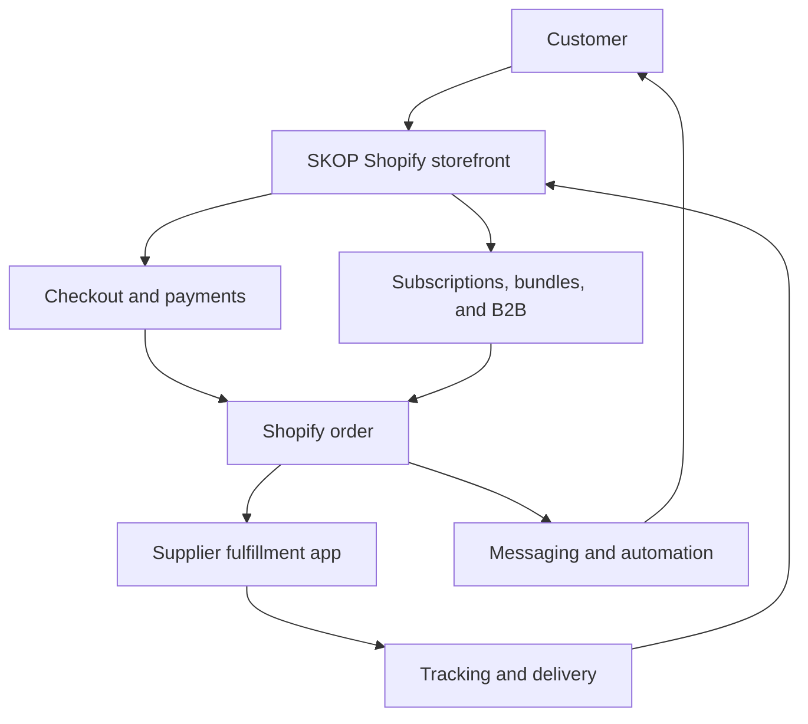
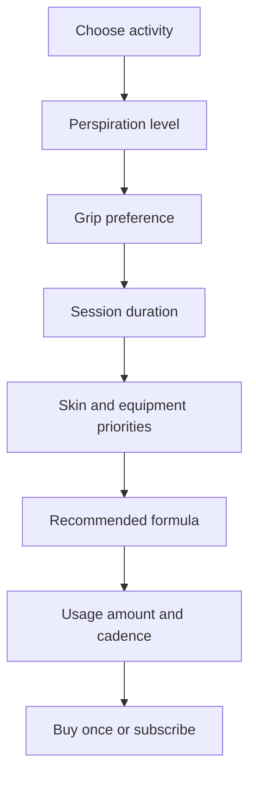

# SKOP Shopify Store Design Specification

**Status:** Approved design

**Date:** July 26, 2026

**Target launch:** Within 2 to 3 months

**Primary domain:** `skop.us`

## 1. Executive Summary

SKOP will launch as a premium, broadly affordable performance-gel brand on Shopify. The product is a fast-drying gel, not a chalk or cream, intended to temporarily reduce hand perspiration and improve grip through formulation-specific mechanisms.

The initial catalog contains five distinct 50 ml formulations:

1. Shooting
2. Racket sports
3. Climbing, CrossFit, weightlifting, and ninja
4. Pole dancing
5. Drumming and gaming

The store will be direct-to-consumer first. It will also support lightweight wholesale accounts and preserve a clear upgrade path to more advanced B2B functionality. Customers can make one-time purchases or subscribe for replenishment every 4, 6, or 8 weeks.

The approved technical direction is a native-first Shopify build using Shopify Basic, a customized free Shopify theme, Shopify-hosted checkout, first-party Shopify apps where practical, and the supplier's native Shopify integration.

## 2. Goals and Success Criteria

### 2.1 Business goals

- Establish SKOP as a credible, patented performance technology brand.
- Help customers quickly select the correct sport-specific formulation.
- Convert customers through evidence, demonstrations, and trusted endorsements.
- Build recurring revenue through subscriptions.
- Increase average order value through discovery kits, multipacks, and build-your-own bundles.
- Support wholesale demand without requiring Shopify Plus or a separate B2B store at launch.
- Keep the initial recurring app cost as low as reasonably possible.
- Preserve a clean upgrade path for additional markets, French localization, and advanced B2B features.

### 2.2 Customer goals

- Understand how SKOP differs from liquid chalk and cream.
- Identify the correct formulation without reading every product page.
- Review validated performance, ingredient, safety, and usage information.
- Choose between one-time purchase and automatic replenishment.
- Receive transparent shipping, subscription, return, and cancellation information.
- Access a clear wholesale application and ordering process when applicable.

### 2.3 Launch success criteria

- All five formulation families are represented consistently across navigation, product pages, packaging, and the formula finder.
- U.S. and Canadian customers can complete tested purchases in the appropriate market and currency.
- One-time, subscription, bundle, and approved wholesale orders route correctly to the supplier.
- Inventory, fulfillment, tracking, cancellations, and exceptions synchronize reliably.
- Product claims displayed on the storefront match validated evidence and approved labels.
- Core mobile pages meet the agreed performance and accessibility targets.
- Analytics, consent, attribution, transactional messaging, and post-purchase flows are validated before launch.

## 3. Scope

### 3.1 Included in the initial launch

- New Shopify store and Shopify Basic plan
- `skop.us` domain connection
- Precision Performance brand direction
- Customized native Shopify theme
- U.S. and Canadian markets
- English-language storefront
- Five product families and sport-specific landing pages
- Formula finder
- Individual products and defined bundle types
- One-time and subscription purchasing
- Lightweight wholesale application, approval, catalog, and ordering
- Supplier's native Shopify fulfillment integration
- Product evidence, safety, endorsement, testimonial, and video components
- Transactional and launch marketing automations
- Analytics, search optimization, structured data, and social metadata
- Security, privacy, testing, and launch-readiness configuration

### 3.2 Deferred from the initial launch

- Headless storefront
- Separate wholesale store
- Company-specific wholesale catalogs and advanced B2B payment terms
- Native mobile application
- Markets beyond the United States and Canada
- French localization
- Custom ERP or warehouse-management integration
- Loyalty program unless the launch strategy later demonstrates a clear need

## 4. Brand and Product Positioning

### 4.1 Brand

- Name: SKOP
- Domain: `skop.us`
- Positioning: Premium performance technology that remains broadly affordable
- Personality: Precise, technical, credible, controlled, modern, and evidence-led
- Approved visual direction: Precision Performance

### 4.2 Customer-facing differentiation

SKOP will be positioned around:

- Better perspiration reduction
- Stronger or more controlled grip
- Longer duration
- Cleaner equipment
- Gentler ingredients
- Faster drying
- Patented technology
- Sport-specific formulations
- Gel format rather than chalk or cream

Every quantified or regulated claim must be tied to approved evidence. The provisional headline, "Control Sweat. Control the Grip.", remains subject to final claims review.

### 4.3 Evidence model

The initial store is designed to support:

- Laboratory and comparative test results
- Ingredient and safety documentation
- Athlete or expert endorsements
- Customer trials and testimonials
- Demonstration videos

Claims, evidence, and endorsements will be reusable structured content so they can appear consistently across product pages, sport pages, the homepage, and marketing content.

## 5. Visual System

### 5.1 Master palette

- Graphite: primary dark background and text
- Mineral white: primary light background
- Pure white: product and content surfaces
- Electric mint: master-brand accent and primary calls to action

### 5.2 Formulation accents

- Shooting: precision amber
- Racket sports: performance lime
- Climbing, CrossFit, weightlifting, and ninja: electric cyan
- Pole dancing: controlled magenta
- Drumming and gaming: technical violet

### 5.3 Packaging treatment

- All products use 50 ml tubes.
- Tube structure and typography remain consistent across the catalog.
- Each formulation uses its assigned accent color for immediate recognition.
- Packaging emphasizes the SKOP master brand, formulation identifier, activity family, volume, and approved product claims.

### 5.4 Photography and motion

- Prioritize close-up hand interaction, equipment contact, controlled movement, and real sport contexts.
- Avoid generic chalk clouds, excessive dust, and conventional bodybuilding imagery.
- Use motion to demonstrate application, drying, contact, and performance.
- Respect reduced-motion browser preferences.

## 6. Store Architecture

SKOP will use one blended Shopify store for DTC and wholesale customers.

### 6.1 Platform decisions

- Shopify Basic
- Native Shopify theme architecture using Liquid, JSON templates, CSS, and minimal JavaScript
- Shopify-hosted checkout
- Shopify customer accounts
- Shopify Markets for the United States and Canada
- Shopify Payments where eligibility and business verification permit
- Supplier's native Shopify integration

### 6.2 Upgrade path

The architecture permits later migration to:

- More advanced Shopify plans
- Additional B2B catalogs and company-specific pricing
- Advanced B2B payment workflows
- Canadian French and additional languages
- Additional markets
- A premium subscription or bundle platform
- A headless storefront if future requirements justify it

## 7. Information Architecture

### 7.1 Primary navigation

- Shop
- Find Your Formula
- How It Works
- Results
- Wholesale

### 7.2 Shop structure

- Shooting
- Racket sports
- Climbing, CrossFit, weightlifting, and ninja
- Pole dancing
- Drumming and gaming
- Five-formulation discovery kit
- Build-your-own bundles
- Same-formulation multipacks
- Subscription starter bundles

### 7.3 Supporting pages

- About SKOP
- Patent and technology
- Laboratory results
- Ingredients and safety
- Application instructions
- Athletes and experts
- Customer stories
- Frequently asked questions
- Contact and support
- Shipping policy
- Return and refund policy
- Subscription policy
- Privacy policy
- Terms of service
- Accessibility statement
- Wholesale application

## 8. Homepage Design

The homepage follows this conversion sequence:

1. Patent-backed performance promise
2. Clear explanation of gel versus chalk and cream
3. Formula finder call to action
4. Concise proof bar: fast, clean, lasting, and proven
5. Five formulation families
6. How SKOP works
7. Comparative performance evidence
8. Demonstration video
9. Athlete and expert validation
10. Bundles and Subscribe and Save
11. Testimonials and customer results
12. Wholesale invitation
13. Email capture

The homepage will not present unvalidated claims as final facts. Evidence sections will indicate the source, test method, and applicable formulation where appropriate.

## 9. Product Detail Page Design

Each formulation receives its own product page and supplier SKU.

### 9.1 Purchase panel

- Product name and formulation family
- 50 ml size
- Formulation accent
- Price in the active market
- One-time purchase
- Subscribe and save
- Replenishment frequency: 4, 6, or 8 weeks
- Quantity selector
- Add-to-cart action
- Estimated delivery information
- Applicable subscription, shipping, and cancellation disclosures

One-time purchase remains the default selection. Subscription is clearly promoted but is not preselected.

### 9.2 Product content

- Formula-specific benefits and target activities
- Application instructions
- Drying time and expected duration
- Grip profile and equipment-residue information
- Ingredients and safety information
- Laboratory and comparative results
- Patent information
- Demonstration video
- Athlete or expert endorsement
- Customer reviews and testimonials
- Frequently asked questions
- Related products and bundles

## 10. Formula Finder

The formula finder will be implemented as lightweight theme logic backed by product metafields. It will not require a recurring quiz-app subscription.

### 10.1 Decision behavior

- Activity determines the formulation family.
- Perspiration level, grip preference, session duration, and skin or equipment priorities tailor the explanation.
- The result recommends application amount, pack size, and replenishment interval.
- Each result explains why the formulation was selected.
- The result links directly to one-time and subscription purchase options.
- If the product is unavailable, the result offers a waitlist and does not silently substitute another formulation.

### 10.2 Configuration

Recommendation rules will be stored in editable theme settings or Shopify metaobjects. The implementation will validate that every supported answer path resolves to one published formulation or an explicit unavailable state.

## 11. Subscription Model

- Eligible individual tubes can be purchased once or subscribed to.
- Replenishment intervals are 4, 6, or 8 weeks.
- Subscription pricing and discount percentage are configured after final retail pricing is approved.
- Customers can view and manage eligible subscription actions through Shopify customer accounts.
- Renewal, payment failure, retry, and cancellation communications use branded templates.
- The subscription cancellation policy is visible before checkout.

## 12. Bundle Model

| Offer                          | Implementation                                                        |
| ------------------------------ | --------------------------------------------------------------------- |
| Individual tube                | Standard product, one-time or subscription                            |
| Five-formulation discovery kit | Dedicated supplier-managed SKU                                        |
| Subscription starter bundle    | Dedicated supplier-managed SKU                                        |
| Same-formulation multipacks    | Dedicated 2-, 3-, or 6-tube SKUs or variants                          |
| Build-your-own bundle          | Selected products added as separate cart items with a bundle discount |
| Wholesale cases                | B2B-only case SKUs and catalog pricing                                |

Shopify's native Bundles app is not compatible with Shopify Subscriptions and does not support mix-and-match bundles. Any kit that must support recurring purchase is therefore represented as a supplier-managed product SKU. Build-your-own bundles remain cart-level combinations unless a paid bundle platform is later justified.

Supplier acceptance of composite bundle SKUs is a launch prerequisite for subscription starter bundles and discovery kits.

## 13. Wholesale Design

The launch uses a lightweight wholesale model within the blended store:

1. Prospective buyer submits a wholesale application.
2. Shopify Forms records the application.
3. Shopify Flow creates an internal review task.
4. An authorized administrator approves or declines the application.
5. Approved buyers receive an authenticated customer account.
6. Approved accounts access wholesale products, case packs, and catalog pricing.
7. Wholesale orders enter the same supplier fulfillment workflow as DTC orders.

The initial model supports catalog pricing and minimum-order rules. Company-specific pricing, deposits, partial payments, purchase orders, and net terms are later-stage capabilities.

## 14. Shopify Data Model

### 14.1 Product metafields

- Formulation family
- Formulation code
- Accent color
- Supported activities
- Perspiration-control profile
- Grip profile
- Expected drying time
- Expected session duration
- Application amount
- Ingredients
- Warnings
- Safety document references
- Evidence references
- Patent references
- Demonstration video
- Subscription eligibility
- Supplier SKU
- Supplier integration metadata
- Bundle type
- Wholesale case quantity

### 14.2 Reusable metaobjects

- Laboratory result
- Comparative test
- Safety document
- Patent reference
- Athlete or expert
- Testimonial
- Frequently asked question
- Sport or activity
- Application method
- Formula-finder rule

The theme consumes these structured records rather than duplicating text across pages.

## 15. App and Integration Stack

### 15.1 Initial first-party stack

- Shopify Subscriptions
- Shopify Forms
- Shopify Flow
- Shopify Messaging
- Shopify Search and Discovery
- Shopify Markets
- Shopify customer accounts and B2B catalogs

### 15.2 Other integrations

- Supplier's native Shopify app
- Review app on its free tier
- Google Analytics 4
- Google Search Console
- Google Merchant Center
- Meta Pixel
- Google advertising integration when campaigns are ready

### 15.3 App-cost rule

A paid app is added only when it:

- Provides a required capability that Shopify cannot deliver cleanly
- Replaces substantial custom development or operational work
- Has acceptable permissions and data-retention practices
- Has a measurable conversion, revenue, or operational benefit

## 16. Fulfillment and Order Data Flow

1. Customer selects product, purchase type, quantity, and market.
2. Shopify validates availability and checkout eligibility.
3. Shopify authorizes payment.
4. Shopify creates the order and sends it to the supplier's native integration.
5. Supplier accepts or rejects the order.
6. Supplier inventory and fulfillment status synchronize to Shopify.
7. Supplier creates shipment and tracking.
8. Tracking synchronizes to Shopify.
9. Shopify sends branded customer notifications.
10. Shopify records order and revenue events for analytics.

### 16.1 Idempotency and reconciliation

- Supplier order references map one-to-one to Shopify order or fulfillment identifiers.
- Duplicate fulfillment events must not create duplicate shipments or notifications.
- A reconciliation view or report identifies paid orders without supplier acceptance, accepted orders without tracking, and delivered orders with unresolved customer-service cases.
- Manual reprocessing requires an explicit operator action and records the reason.

## 17. Error Handling

| Failure                                          | Expected behavior                                                                                      |
| ------------------------------------------------ | ------------------------------------------------------------------------------------------------------ |
| Inventory mismatch                               | Hold the affected line or order, alert operations, and contact the customer                            |
| Supplier rejection                               | Create an exception task, preserve payment state, and choose retry, substitute with consent, or refund |
| Invalid address                                  | Request correction before supplier submission when possible                                            |
| Missing tracking                                 | Alert operations after the agreed supplier service window                                              |
| Delayed fulfillment                              | Notify operations and provide proactive customer messaging                                             |
| Failed subscription payment                      | Use configured retries, notify the customer, and suspend according to policy                           |
| Subscription inventory shortage                  | Pause or skip according to policy, notify the customer, and avoid an unfulfillable charge              |
| Supplier app outage                              | Queue or retain orders in Shopify, prevent duplicate submissions, and reconcile after recovery         |
| Marketing app outage                             | Do not block checkout or fulfillment                                                                   |
| Product unavailable after formula recommendation | Offer a waitlist, not an unapproved formulation substitution                                           |

## 18. Customer Communications

Initial automated flows:

- Welcome sequence
- Abandoned cart
- Abandoned checkout
- Order confirmation
- Product application instructions
- Shipping and delivery updates
- Post-delivery follow-up
- Review and testimonial request
- Replenishment reminder
- Subscription renewal reminder
- Subscription payment failure and retry
- Wholesale application received
- Wholesale application approved or declined

Marketing communications require appropriate consent. Transactional messages remain separate from promotional messages.

## 19. Markets, Shipping, Payments, and Taxes

### 19.1 Markets

- United States: primary market
- Canada: secondary market
- English: initial storefront language
- U.S. dollar and Canadian dollar presentation through Shopify Markets

### 19.2 Québec

The initial business decision is to include Québec while the owner obtains legal advice. Before launch, counsel must review French-language obligations for the storefront, commercial advertising, customer documents, product labels, packaging, privacy disclosures, and related materials.

This specification does not treat the English-only Québec configuration as legally approved.

### 19.3 Shipping

- Supplier fulfills directly to U.S. and Canadian customers.
- Shipping methods, rates, free-shipping thresholds, processing times, delivery estimates, duties, and tax handling must match the supplier agreement.
- Shipping promises display only after supplier service levels are documented and tested.

### 19.4 Payments

Preferred methods, where eligible:

- Shopify Payments
- Shop Pay
- Apple Pay
- Google Pay
- PayPal

Business verification, payout account, chargeback handling, and fraud settings must be completed before launch.

### 19.5 Taxes

Tax configuration requires professional review of:

- U.S. state sales-tax nexus
- Canadian GST, HST, PST, and QST registration and collection obligations
- Product tax classification
- Wholesale resale or exemption documentation
- Tax treatment of shipping and discounts

## 20. Security and Privacy

- Passkey or two-factor authentication for every administrator
- Separate named staff accounts
- Least-privilege staff and collaborator roles
- No shared administrator credentials
- App permission review before installation
- Periodic removal of unused accounts and apps
- Shopify-hosted checkout to avoid custom handling of payment-card data
- SPF, DKIM, and DMARC for `skop.us`
- Cookie and tracking consent appropriate to the active markets
- Clear privacy policy and data-subject request process
- Documented app removal and data-retention procedure
- Backup or export procedure for critical catalog, order, customer, and content data
- Change log for production theme changes

## 21. Analytics and Search

### 21.1 Analytics events

- Product view
- Formula-finder start and completion
- Formula recommendation
- One-time versus subscription selection
- Replenishment interval selection
- Bundle configuration
- Add to cart
- Checkout start
- Purchase
- Wholesale application
- Subscription start, renewal, skip, failure, and cancellation

### 21.2 Search and structured data

- Unique titles and descriptions
- Canonical URLs
- Product, offer, review, organization, breadcrumb, and FAQ structured data where valid
- Sport-specific landing pages with unique content
- Optimized image alt text and dimensions
- XML sitemap and robots configuration
- Redirect plan for renamed products or routes
- Search Console and Merchant Center validation
- Social preview metadata

## 22. Accessibility and Performance

- Target WCAG 2.2 AA for custom components
- Keyboard-accessible navigation, formula finder, purchase controls, and dialogs
- Visible focus states
- Sufficient color contrast
- Text labels in addition to formulation colors
- Semantic heading structure
- Reduced-motion support
- Responsive images and deferred video loading
- Minimal third-party scripts
- Mobile-first layout validation
- Core Web Vitals monitored before and after launch

## 23. Testing Strategy

### 23.1 Functional tests

- Product navigation and search
- Formula-finder paths
- One-time purchases
- Subscription purchases at every interval
- Subscription management and payment failure
- Discovery kit and multipack orders
- Build-your-own bundle discounts
- Wholesale application and approval
- Wholesale account pricing and case orders
- Discount combinations
- Returns and cancellations

### 23.2 Market tests

- U.S. addresses, currency, shipping, and taxes
- Canadian addresses, currency, shipping, duties, and taxes
- Québec address behavior and approved disclosures
- Unsupported-address handling

### 23.3 Integration tests

- Supplier order creation
- Duplicate event handling
- Inventory synchronization
- Supplier rejection
- Cancellation before and after supplier acceptance
- Partial fulfillment
- Tracking synchronization
- Supplier outage and recovery

### 23.4 Presentation tests

- Current desktop and mobile browsers
- Responsive layouts
- Accessibility and keyboard navigation
- Email rendering
- Structured data
- Analytics and consent
- Performance under realistic image and video loads

## 24. Launch Gates

The production launch requires all of the following:

- Final product names
- Final supplier identities and integration details
- Final supplier SKUs, including bundle and wholesale case SKUs
- Final pricing in both markets
- Approved subscription discount
- Confirmed inventory and service levels
- Approved product labels and packaging
- Ingredients and safety documentation
- Approved claims and comparative evidence
- Final patent references
- Athlete and expert permissions
- Customer testimonial permissions
- Final product photography and demonstration videos
- Completed business and payment verification
- Connected payout account
- Connected and authenticated `skop.us` email
- Approved shipping, return, refund, subscription, privacy, and terms policies
- U.S. and Canadian tax review
- Québec language and legal review
- Successful end-to-end test orders for every purchase type and market
- Analytics, consent, security, and accessibility sign-off

## 25. Delivery Sequence

### Phase 1: Foundation

- Create Shopify store
- Configure plan, administrators, security, and domain
- Configure draft market, payment, tax, and shipping settings, keeping customer-facing options inactive until validated
- Establish theme source control and deployment process

### Phase 2: Brand and content system

- Implement design tokens and core theme components
- Create product metafields and metaobjects
- Build homepage, navigation, and supporting templates

### Phase 3: Commerce

- Configure products, supplier SKUs, subscriptions, bundles, and B2B
- Build the formula finder
- Integrate supplier fulfillment

### Phase 4: Evidence and lifecycle

- Add test results, safety documents, endorsements, testimonials, and videos
- Configure messaging and automations
- Configure analytics and search integrations

### Phase 5: Validation and launch

- Complete legal and operational gates
- Run functional, market, integration, accessibility, and performance testing
- Execute controlled launch
- Monitor orders, supplier synchronization, payments, and customer support

## 26. Approved Decisions

- Platform: Shopify
- Store: New store
- Plan direction: Shopify Basic
- Implementation: Native-first custom theme
- Brand: SKOP
- Domain: `skop.us`
- Visual direction: Precision Performance
- Product format: 50 ml tubes
- Product families: Five distinct formulations
- Markets: United States and Canada
- Initial language: English
- Québec: Included while legal advice is obtained
- Sales model: DTC first with lightweight wholesale
- Subscription intervals: 4, 6, or 8 weeks
- Bundles: Discovery, build-your-own, multipack, subscription starter, and wholesale case formats
- Fulfillment: Supplier direct to U.S. and Canadian customers
- Integration: Supplier's native Shopify integration
- Price positioning: Premium, broadly affordable
- Launch target: Within 2 to 3 months
- App budget: Minimum sensible recurring stack

## 27. Reference Notes

- Monkey Hands was reviewed as a category and customer-journey benchmark. SKOP will not copy its branding, text, imagery, or proprietary implementation.
- Current Shopify documentation confirms that native Shopify Bundles do not support Shopify Subscriptions or mix-and-match bundles. The dedicated-SKU approach in this specification addresses that constraint.
- Current Shopify B2B capabilities provide an initial blended-store path, with more advanced company-specific and payment capabilities available through later upgrades.
